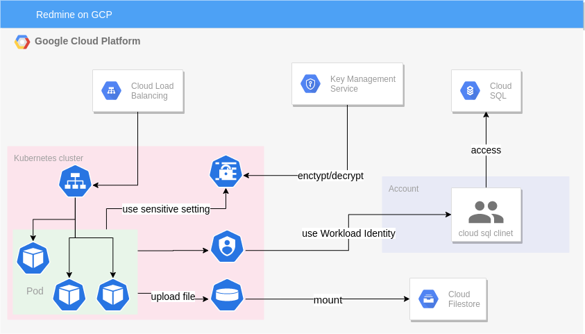

# redmine+gcp template

Template to run redmine on gcp



## Required

- smtp credentials
- domain
- cui tools
  - git
  - terraform
  - gcloud
  - docker

## Initialize

1. set project

```shell
$ gcloud config set project ${taget-project}
```

2. activate services

```shell
$ ./script/activate.sh ${taget-project}
```

3. edit sensitive.tfvars and docker/configuration.yml

- `project_id` project id
- `db_pass` password of database user used by redmine
- `secret_key` used by Rails to encode cookies storing session data
- `configuration.yml` smtp settings

4. initialize terraform

```
$ terraform init
```

5. create artifact_registry

```
$ terraform apply \
    -var "docker_tag=$(./script/directory_hash.sh ./docker)" \
    -var-file ./sensitive.tfvars \
    -target google_artifact_registry_repository.redmine_repo
```

6. build and submit docker

```
$ ./script/docker_submit.sh $project_id
```

7. run terraform

```
$ terraform apply \
    -var "docker_tag=$(./script/directory_hash.sh ./docker)" \
    -var-file ./sensitive.tfvars \
```

8. edit redminie_certificate.yml

Add your domain.

```
spec:
  domains:
    ## add domains
    - redmine.example.com
```

9. connect gke cluster

```shell
$ gcloud container clusters get-credentials redmine-cluster --region asia-northeast1
```

10. apply certificate setting

```sh
$ kubectl apply -f ./kubectl/redmine_certificate.yml
```

11. check global address

```shell
$ gcloud compute addresses describe redmine-address --global | grep address:
```

12. configure the DNS records for your domains to point to the IP address of the load balancer

13. check certificate status(about 10min)

```shell
$ kubectl describe managedcertificate redmine-certificate --namespace redmine-namespace
...
Spec:
  Domains:
    domain-name
Status:
  CertificateStatus: Active ← check
...
```

※ watch command

```shell
$ kubectl get managedcertificate redmine-certificate --namespace redmine-namespace --watch
```

14. access your domain

https://yourdomain.example.com

- user: admin
- password: admin

### option

change ingress healthcheck

1. edit and apply backendconfig

```
$ kubectl apply -f ./kubectl/backendconfig.yml
```

2. remove comment out from `k8s_svc.tf`

```tf
annotations = {
  "cloud.google.com/neg" = "{\"ingress\": true}"
  "cloud.google.com/backend-config" = "{\"ports\": {\"8080\": \"redmine-backendconfig\"}}"
    }
```

3. terraform apply

## Recommended settings

https://redmine.jp/tech_note/first-step/admin/

## TODO

- [ ] github action

## Author

komem3

## Lisence

Copyright 2020 komem3

Licensed under the Apache License, Version 2.0 (the "License");
you may not use this file except in compliance with the License.
You may obtain a copy of the License at

    http://www.apache.org/licenses/LICENSE-2.0

Unless required by applicable law or agreed to in writing, software
distributed under the License is distributed on an "AS IS" BASIS,
WITHOUT WARRANTIES OR CONDITIONS OF ANY KIND, either express or implied.
See the License for the specific language governing permissions and
limitations under the License.
